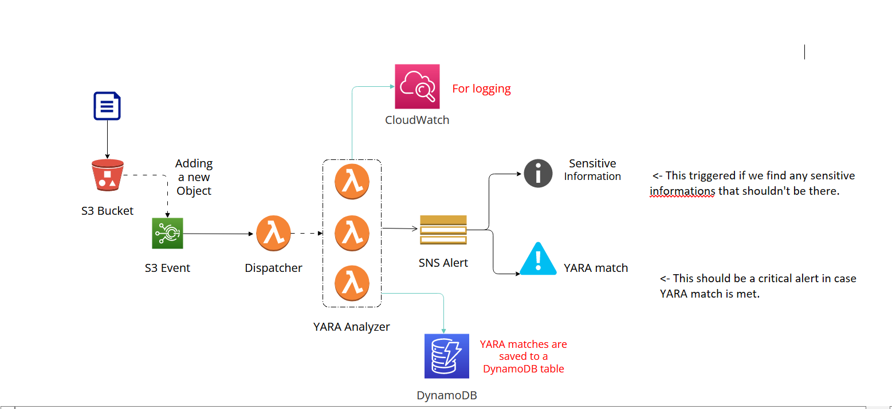

# aws-objalert


## Overview
This project is about creating a serverless AWS pipeline where any object added to an S3 bucket is scanned with YARA rules + Sensitive information detector. If a match is found an alert will be fired, for fast incident response.

## Quick Start
  1. Install dependencies:
      - Install python3, pip3 and [Terraform](https://www.terraform.io/intro/getting-started/install.html).
  2. Configure settings:
      - Set your AWS credentials using any
      [method supported by Terraform](https://www.terraform.io/docs/providers/aws/#authentication).
      The two simplest options are to run `aws configure` (saves `~/.aws/credentials` file) or
      ```bash
      export AWS_DEFAULT_REGION="region-name"
      export AWS_ACCESS_KEY_ID="access-key"
      export AWS_SECRET_ACCESS_KEY="secret-key"
      ```
  3. Makefile guide:
      - You can deploy using :
      ```bash
        make
      ```
      - You can check the help menu using:
      ```bash
        make help
      ```
      - You can run build using :
      ```bash
        make build
      ```
      - You can generate the resources only, using :
      ```bash
        make terraform
      ```
      - You can destroy the resources using :
      ```bash
        make destroy
      ```

## Architecture


## Description
- We start by setting up our ObjAlert system to analyze various files that are collected and delivered to their S3 bucket. The files could be of different types such as executable binaries, email attachments, documents, and more.

- As soon as any file is uploaded to the S3 bucket, it is automatically queued for analysis. A dispatching Lambda function runs every minute to group the files into batches and invoke multiple analyzers in parallel. Each analyzer scans its designated files using a pre-compiled list of YARA rules.

- Any YARA matches found during analysis are stored in DynamoDB, and an alert is sent to an SNS topic. To dispatch these alerts, we can use emails or other supported SNS subscription methods.

- For retroactive analysis, a batching Lambda function enqueues the entire S3 bucket for re-analysis.

- In addition, a preconfigurable CloudWatch alarms are set up be to triggered if any component of the ObjAlert system behaves abnormally. These alarms will notify a different SNS topic than the one used for YARA match alerts, allowing for efficient management of any issues that arise.

## Recourses
### Lambda Base Module
This module consists of several resources, including an IAM policy document, an IAM execution role, an IAM policy attachment, a CloudWatch log group, a Lambda function, a Lambda alias, and two CloudWatch alarms.

### Other Services
- CloudWatch
- DynamoDB
- SQS
- SNS
- S3Buckets
- Lambda functions

For more details about the infrastructure you can check the terraform folder.